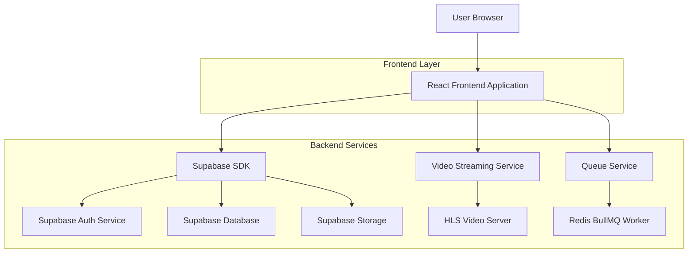
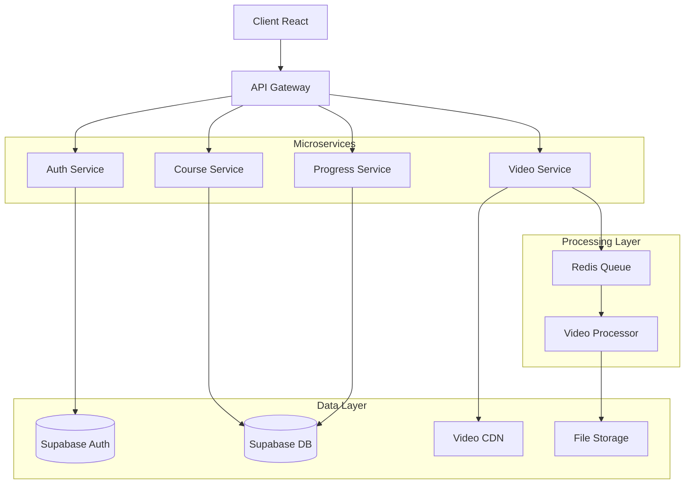
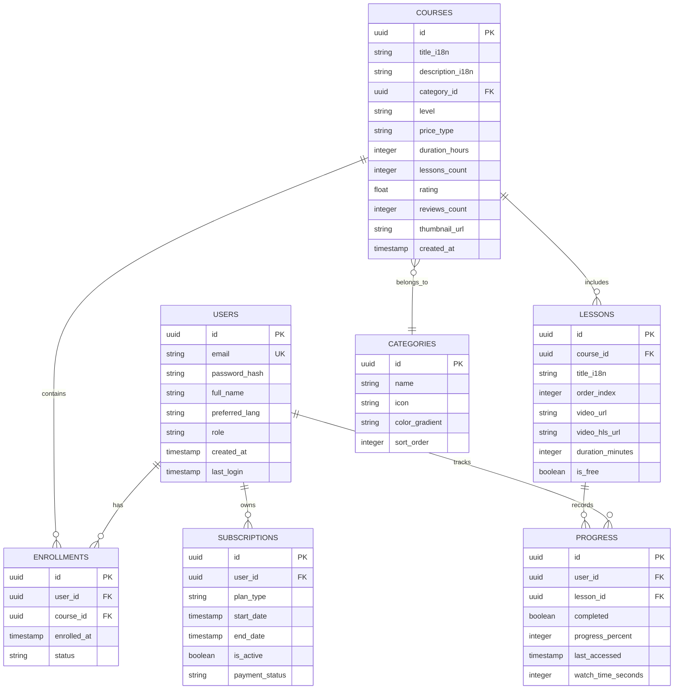

## 1. Architecture design



## 2. Technology Description

- **Frontend**: React@18 + tailwindcss@3 + lucide-react
- **Initialization Tool**: vite-init
- **Backend**: Supabase (Auth, Database, Storage)
- **Queue System**: Redis + BullMQ for video processing
- **Video Streaming**: HLS.js for adaptive streaming
- **Internationalization**: react-i18next
- **State Management**: React Context + useState

## 3. Route definitions

| Route | Purpose |
|-------|---------|
| / | Page d'accueil avec catalogue des formations |
| /login | Page de connexion utilisateur |
| /register | Page d'inscription nouvel utilisateur |
| /catalog | Catalogue complet des formations avec filtres |
| /categories | Navigation par catégories technologiques |
| /course/:id | Page détaillée d'une formation |
| /player/:courseId | Lecteur vidéo avec table des matières |
| /dashboard | Tableau de bord personnel de l'apprenant |
| /profile | Profil utilisateur et paramètres |

## 4. API definitions

### 4.1 Authentication APIs

```
POST /api/auth/login
```

Request:
| Param Name | Param Type | isRequired | Description |
|------------|------------|------------|-------------|
| email | string | true | Adresse email de l'utilisateur |
| password | string | true | Mot de passe (hashé côté client) |

Response:
| Param Name | Param Type | Description |
|------------|------------|-------------|
| user | object | Données utilisateur (id, email, name) |
| session | object | Session JWT et refresh token |
| subscription | object | Statut d'abonnement (free/premium) |

### 4.2 Course APIs

```
GET /api/courses
```

Query Parameters:
| Param Name | Param Type | Description |
|------------|------------|-------------|
| category | string | Filtrer par catégorie (WINDEV/WEBDEV/etc) |
| level | string | Niveau (beginner/intermediate/expert) |
| price | string | Type de prix (FREE/PREMIUM) |
| search | string | Recherche textuelle dans titres et descriptions |

```
GET /api/courses/:id/progress
```

Response:
| Param Name | Param Type | Description |
|------------|------------|-------------|
| courseId | string | ID du cours |
| userProgress | number | Pourcentage de progression (0-100) |
| completedLessons | array | IDs des leçons terminées |
| lastAccessed | timestamp | Dernière consultation |

### 4.3 Video Streaming APIs

```
GET /api/video/:lessonId/stream
```

Response Headers:
- Content-Type: application/vnd.apple.mpegurl (HLS)
- Cache-Control: public, max-age=3600

## 5. Server architecture diagram



## 6. Data model

### 6.1 Data model definition



### 6.2 Data Definition Language

**Users Table (users)**
```sql
-- create table
CREATE TABLE users (
    id UUID PRIMARY KEY DEFAULT gen_random_uuid(),
    email VARCHAR(255) UNIQUE NOT NULL,
    password_hash VARCHAR(255) NOT NULL,
    full_name VARCHAR(100) NOT NULL,
    preferred_lang VARCHAR(5) DEFAULT 'fr' CHECK (preferred_lang IN ('fr', 'en', 'ar')),
    role VARCHAR(20) DEFAULT 'user' CHECK (role IN ('user', 'admin')),
    created_at TIMESTAMP WITH TIME ZONE DEFAULT NOW(),
    last_login TIMESTAMP WITH TIME ZONE,
    updated_at TIMESTAMP WITH TIME ZONE DEFAULT NOW()
);

-- create indexes
CREATE INDEX idx_users_email ON users(email);
CREATE INDEX idx_users_role ON users(role);

-- RLS policies
ALTER TABLE users ENABLE ROW LEVEL SECURITY;
CREATE POLICY "Users can view own profile" ON users FOR SELECT USING (auth.uid() = id);
CREATE POLICY "Users can update own profile" ON users FOR UPDATE USING (auth.uid() = id);
```

**Courses Table (courses)**
```sql
-- create table
CREATE TABLE courses (
    id UUID PRIMARY KEY DEFAULT gen_random_uuid(),
    title_i18n JSONB NOT NULL,
    description_i18n JSONB,
    category_id UUID REFERENCES categories(id),
    level VARCHAR(20) CHECK (level IN ('beginner', 'intermediate', 'expert')),
    price_type VARCHAR(10) CHECK (price_type IN ('FREE', 'PREMIUM')),
    duration_hours INTEGER DEFAULT 0,
    lessons_count INTEGER DEFAULT 0,
    rating DECIMAL(3,2) DEFAULT 0.0,
    reviews_count INTEGER DEFAULT 0,
    thumbnail_url TEXT,
    created_at TIMESTAMP WITH TIME ZONE DEFAULT NOW(),
    updated_at TIMESTAMP WITH TIME ZONE DEFAULT NOW()
);

-- create indexes
CREATE INDEX idx_courses_category ON courses(category_id);
CREATE INDEX idx_courses_level ON courses(level);
CREATE INDEX idx_courses_price ON courses(price_type);

-- RLS policies
ALTER TABLE courses ENABLE ROW LEVEL SECURITY;
CREATE POLICY "Anyone can view published courses" ON courses FOR SELECT USING (true);
CREATE POLICY "Admins can manage courses" ON courses FOR ALL USING (auth.jwt() ->> 'role' = 'admin');
```

**Categories Table (categories)**
```sql
-- create table
CREATE TABLE categories (
    id UUID PRIMARY KEY DEFAULT gen_random_uuid(),
    name VARCHAR(50) UNIQUE NOT NULL,
    icon VARCHAR(50) NOT NULL,
    color_gradient VARCHAR(100),
    sort_order INTEGER DEFAULT 0,
    created_at TIMESTAMP WITH TIME ZONE DEFAULT NOW()
);

-- insert initial data
INSERT INTO categories (name, icon, color_gradient, sort_order) VALUES
('WINDEV', 'Monitor', 'from-blue-500 to-blue-700', 1),
('WEBDEV', 'Globe', 'from-purple-500 to-purple-700', 2),
('MOBILE', 'Smartphone', 'from-green-500 to-green-700', 3),
('HFSQL', 'Database', 'from-yellow-500 to-yellow-700', 4),
('WLANGAGE', 'Code', 'from-red-500 to-red-700', 5),
('PACKS', 'Package', 'from-gray-600 to-gray-800', 6);
```

**Progress Table (progress)**
```sql
-- create table
CREATE TABLE progress (
    id UUID PRIMARY KEY DEFAULT gen_random_uuid(),
    user_id UUID REFERENCES users(id) ON DELETE CASCADE,
    lesson_id UUID REFERENCES lessons(id) ON DELETE CASCADE,
    completed BOOLEAN DEFAULT false,
    progress_percent INTEGER DEFAULT 0 CHECK (progress_percent >= 0 AND progress_percent <= 100),
    last_accessed TIMESTAMP WITH TIME ZONE DEFAULT NOW(),
    watch_time_seconds INTEGER DEFAULT 0,
    UNIQUE(user_id, lesson_id)
);

-- create indexes
CREATE INDEX idx_progress_user ON progress(user_id);
CREATE INDEX idx_progress_lesson ON progress(lesson_id);
CREATE INDEX idx_progress_completed ON progress(completed);

-- RLS policies
ALTER TABLE progress ENABLE ROW LEVEL SECURITY;
CREATE POLICY "Users can view own progress" ON progress FOR SELECT USING (auth.uid() = user_id);
CREATE POLICY "Users can update own progress" ON progress FOR ALL USING (auth.uid() = user_id);
```

**Subscriptions Table (subscriptions)**
```sql
-- create table
CREATE TABLE subscriptions (
    id UUID PRIMARY KEY DEFAULT gen_random_uuid(),
    user_id UUID REFERENCES users(id) ON DELETE CASCADE,
    plan_type VARCHAR(20) CHECK (plan_type IN ('FREE', 'PREMIUM', 'ENTERPRISE')),
    start_date TIMESTAMP WITH TIME ZONE DEFAULT NOW(),
    end_date TIMESTAMP WITH TIME ZONE,
    is_active BOOLEAN DEFAULT true,
    payment_status VARCHAR(20) DEFAULT 'pending',
    created_at TIMESTAMP WITH TIME ZONE DEFAULT NOW()
);

-- create indexes
CREATE INDEX idx_subscriptions_user ON subscriptions(user_id);
CREATE INDEX idx_subscriptions_active ON subscriptions(is_active) WHERE is_active = true;

-- RLS policies
ALTER TABLE subscriptions ENABLE ROW LEVEL SECURITY;
CREATE POLICY "Users can view own subscriptions" ON subscriptions FOR SELECT USING (auth.uid() = user_id);
```

**Grant Permissions**
```sql
-- Grant basic read access to anon role
GRANT SELECT ON categories TO anon;
GRANT SELECT ON courses TO anon;

-- Grant full access to authenticated users
GRANT ALL PRIVILEGES ON users TO authenticated;
GRANT ALL PRIVILEGES ON courses TO authenticated;
GRANT ALL PRIVILEGES ON lessons TO authenticated;
GRANT ALL PRIVILEGES ON progress TO authenticated;
GRANT ALL PRIVILEGES ON subscriptions TO authenticated;
GRANT ALL PRIVILEGES ON enrollments TO authenticated;
```