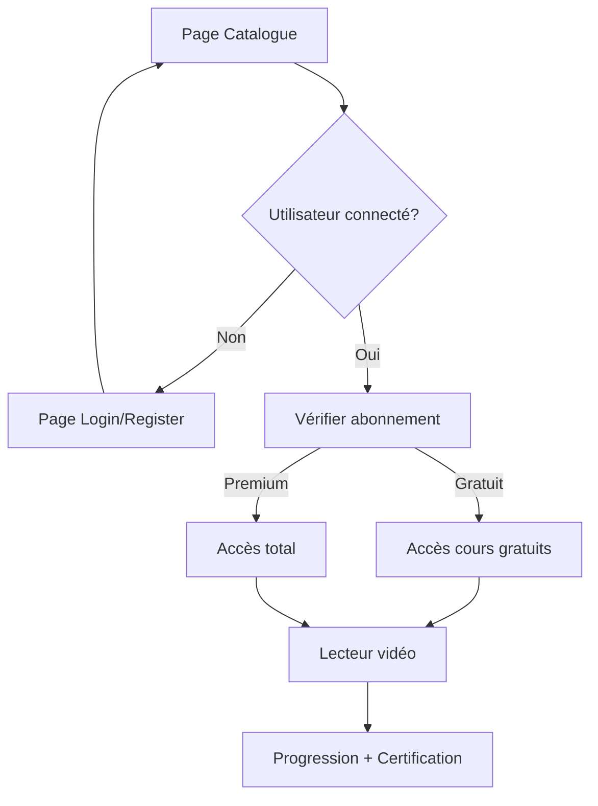

## 1. Product Overview

Plateforme d'apprentissage en ligne spécialisée dans les technologies WinDev (WINDEV, WEBDEV, WINDEV Mobile, HFSQL, WLangage). L'académie permet aux développeurs de maîtriser le WLangage et les outils PC SOFT à travers des formations vidéo structurées avec certification.

Cible: Développeurs francophones, anglophones et arabophones souhaitant se spécialiser dans l'écosystème WinDev.

## 2. Core Features

### 2.1 User Roles

| Role      | Registration Method         | Core Permissions                                           |
| --------- | --------------------------- | ---------------------------------------------------------- |
| Visiteur  | Email/password              | Consulter catalogue, pages publiques                       |
| Apprenant | Email/password + validation | Accès aux cours gratuits, progression, certification       |
| Premium   | Paiement souscription       | Accès illimité à tous les cours, téléchargement ressources |

### 2.2 Feature Module

L'académie comprend les pages essentielles suivantes:

1. **Page d'accueil/catalogue**: Recherche de formations, filtres multicritères, grille de cours
2. **Page de catégories**: Navigation par technologie (WINDEV, WEBDEV, MOBILE, HFSQL, WLANGAGE)
3. **Page d'authentification**: Connexion/inscription multilingue
4. **Lecteur vidéo**: Lecture de cours avec table des matières, progression, certification
5. **Tableau de bord d'apprentissage**: Suivi de progression personnel

### 2.3 Page Details

| Page Name        | Module Name            | Feature description                                                                   |
| ---------------- | ---------------------- | ------------------------------------------------------------------------------------- |
| Catalogue        | Barre de recherche     | Rechercher des formations par mots-clés avec suggestions automatiques                 |
| Catalogue        | Filtres multicritères  | Filtrer par catégorie, niveau (débutant/intermédiaire/expert), prix (gratuit/premium) |
| Catalogue        | Grille de cours        | Afficher les formations avec vignette, titre, auteur, durée, niveau, prix, note       |
| Catégories       | Cartes technologiques  | 6 catégories principales avec icônes et dégradés colorés                              |
| Authentification | Formulaire multilingue | Champs email/mot de passe avec validation, bascule login/register                     |
| Lecteur vidéo    | Lecteur HTML5          | Contrôles lecture, progression vidéo avec timeline interactive                        |
| Lecteur vidéo    | Table des matières     | Navigation par modules et leçons avec indicateurs de progression                      |
| Lecteur vidéo    | Onglets d'information  | Vue d'ensemble, Q\&A, ressources téléchargeables                                      |
| Navigation       | Sélecteur de langue    | Support FR/EN/AR avec mise en page RTL pour arabe                                     |
| Navigation       | Toggle thème           | Basculer entre mode clair et sombre avec transitions fluides                          |

## 3. Core Process

### Flux Utilisateur Principal

1. **Découverte**: L'utilisateur arrive sur le catalogue, consulte les formations disponibles
2. **Recherche**: Utilise la barre de recherche et les filtres pour trouver une formation
3. **Sélection**: Clique sur une formation pour voir les détails
4. **Authentification**: Se connecte ou crée un compte pour accéder au contenu
5. **Apprentissage**: Visionne les vidéos, suit sa progression dans la table des matières
6. **Certification**: Obtient une certification à la fin du parcours

### Flux Utilisateur Premium

Même flux avec accès immédiat à tout le contenu sans restriction.

## 4. User Interface Design

### 4.1 Design Style

* **Couleurs principales**: Dégradés bleus/oranges (yellow-500 to orange-600, blue-500 to purple-700)

* **Couleurs secondaires**: Gris slate pour fonds et bordures

* **Boutons**: Style dégradé avec ombres portées, coins arrondis (rounded-xl)

* **Typographie**: Inter pour latin, Cairo pour arabe

* **Layout**: Cards-based avec ombres et bordures, navigation sticky top

* **Animations**: Transitions fluides, hover effects avec scale, blur backdrop

* **Icônes**: Lucide React avec taille adaptée (16-36px selon contexte)

### 4.2 Page Design Overview

| Page Name  | Module Name  | UI Elements                                                                       |
| ---------- | ------------ | --------------------------------------------------------------------------------- |
| Catalogue  | Header       | Titre principal gauche, barre recherche droite, fond blanc/sombre                 |
| Catalogue  | Filtres      | Select dropdowns arrondis, icône Filter, fond blanc avec bordures                 |
| Catalogue  | Grille cours | Cards 3 colonnes, dégradés de couleurs par catégorie, hover shadow-2xl            |
| Catégories | Cartes       | Height 48, overlay noir 10-30%, icônes centrés, texte blanc                       |
| Login      | Formulaire   | Max-width md, fond blanc avec ombres, inputs avec icônes gauche, boutons dégradés |
| Lecteur    | Vidéo        | Aspect-video 16:9, contrôles centrés, timeline jaune avec curseur                 |
| Lecteur    | Sidebar      | Width 96, table des matières scrollable, modules collapsibles                     |

### 4.3 Responsiveness

* **Desktop-first**: Design optimisé pour écrans larges (max-w-7xl)

* **Mobile-adaptive**: Menu hamburger, grille 1 colonne sur mobile

* **Touch optimization**: Boutons taille minimum 44px, espacement adapté

* **RTL Support**: Direction droite-à-gauche complète pour arabe

