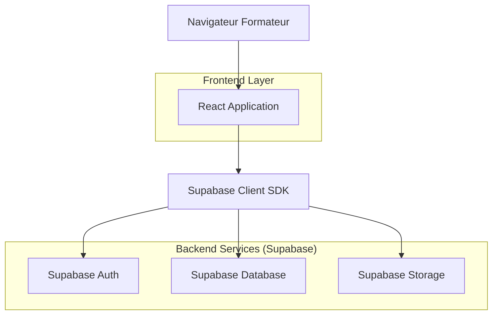
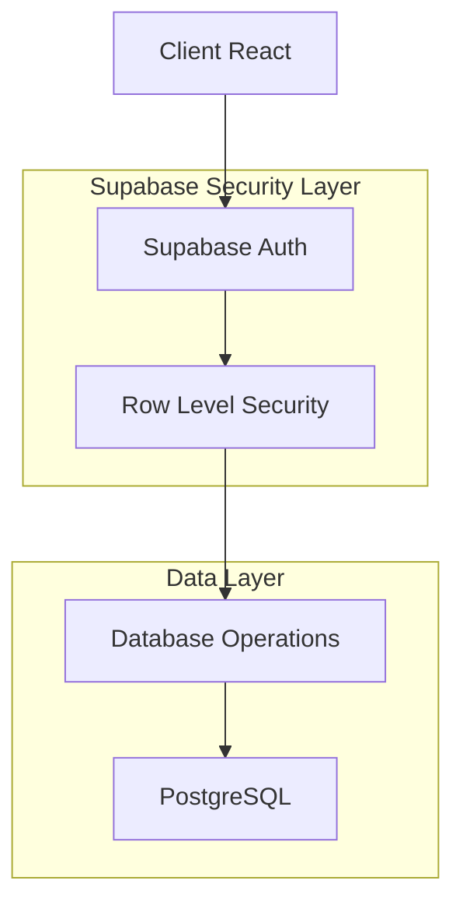
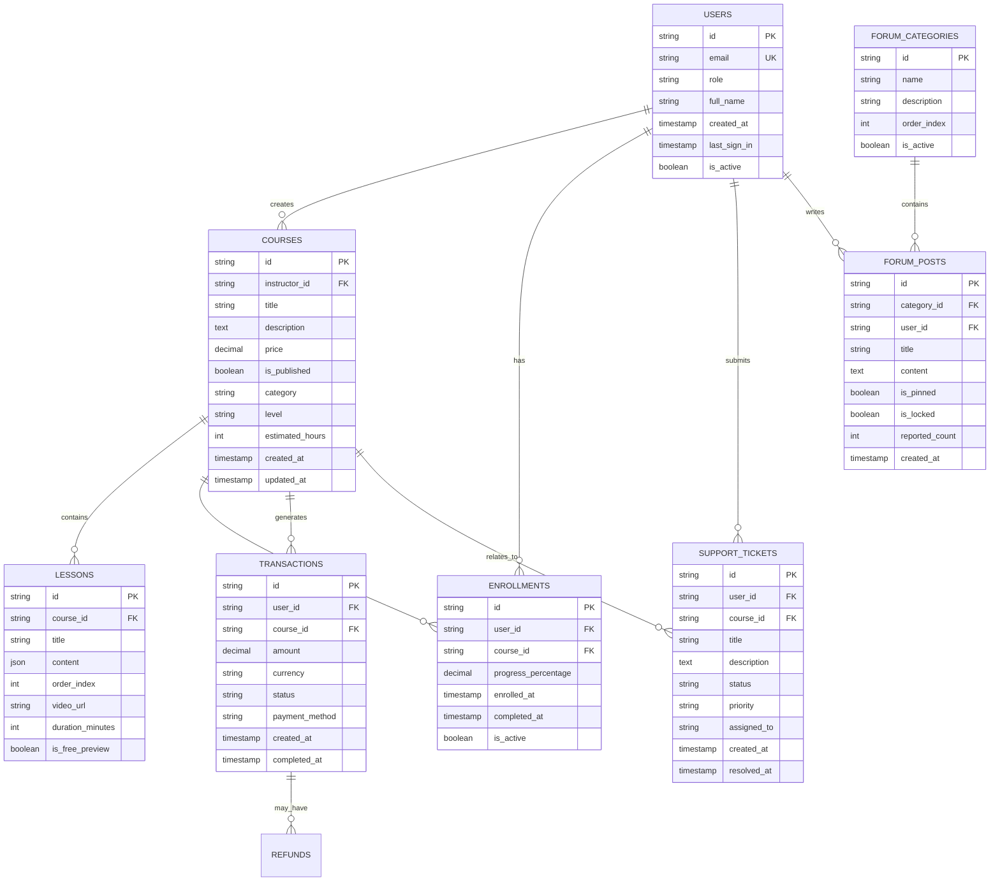

## 1. Architecture du système



## 2. Description des technologies

- **Frontend** : React@18 + TypeScript + TailwindCSS@3 + Vite
- **Outil d'initialisation** : vite-init
- **Backend** : Supabase (Backend-as-a-Service)
- **Base de données** : PostgreSQL (via Supabase)
- **Authentification** : Supabase Auth
- **Stockage de fichiers** : Supabase Storage
- **État global** : React Context + useReducer
- **Tableaux de données** : TanStack Table
- **Graphiques** : Chart.js + react-chartjs-2
- **Éditeur de texte riche** : TipTap

## 3. Définition des routes

| Route | Objectif |
|-------|----------|
| /dashboard | Tableau de bord principal avec métriques et analytics |
| /courses | Gestion des cours (liste, création, modification) |
| /courses/new | Création d'un nouveau cours |
| /courses/:id | Édition d'un cours existant |
| /courses/:id/content | Gestion du contenu du cours |
| /finance | Vue d'ensemble des finances et revenus |
| /finance/transactions | Historique des transactions et paiements |
| /finance/invoices | Gestion et export des factures |
| /students | Liste et gestion des apprenants |
| /students/:id | Détail d'un apprenant et sa progression |
| /support | Centre d'assistance et tickets |
| /support/tickets/:id | Détail et réponse à un ticket |
| /forum | Modération du forum et discussions |
| /forum/categories | Gestion des catégories du forum |
| /settings | Configuration générale de la plateforme |
| /settings/integrations | Gestion des intégrations tierces |
| /settings/branding | Personnalisation visuelle de la plateforme |
| /profile | Profil personnel du formateur-admin |

## 4. Définitions API

### 4.1 API Supabase - Tables principales

#### Cours (courses)
```typescript
interface Course {
  id: string
  title: string
  description: string
  price: number
  is_published: boolean
  instructor_id: string
  created_at: string
  updated_at: string
  thumbnail_url?: string
  category: string
  level: 'beginner' | 'intermediate' | 'advanced'
  estimated_hours: number
}
```

#### Leçons (lessons)
```typescript
interface Lesson {
  id: string
  course_id: string
  title: string
  content: JSON
  order_index: number
  video_url?: string
  duration_minutes?: number
  is_free_preview: boolean
  resources?: string[]
}
```

#### Transactions (transactions)
```typescript
interface Transaction {
  id: string
  user_id: string
  course_id: string
  amount: number
  currency: string
  status: 'pending' | 'completed' | 'refunded' | 'failed'
  payment_method: string
  stripe_payment_intent_id?: string
  created_at: string
  refunded_at?: string
}
```

#### Tickets de support (support_tickets)
```typescript
interface SupportTicket {
  id: string
  user_id: string
  course_id?: string
  title: string
  description: string
  status: 'open' | 'in_progress' | 'resolved' | 'closed'
  priority: 'low' | 'medium' | 'high' | 'urgent'
  assigned_to?: string
  created_at: string
  updated_at: string
  resolved_at?: string
}
```

#### Messages du forum (forum_posts)
```typescript
interface ForumPost {
  id: string
  category_id: string
  user_id: string
  title: string
  content: string
  is_pinned: boolean
  is_locked: boolean
  reported_count: number
  created_at: string
  updated_at: string
}
```

## 5. Architecture serveur



## 6. Modèle de données

### 6.1 Schéma de base de données



### 6.2 Langage de définition des données (DDL)

#### Table des utilisateurs
```sql
-- Table principale des utilisateurs (gérée par Supabase Auth)
CREATE TABLE users (
  id UUID PRIMARY KEY REFERENCES auth.users(id),
  email VARCHAR(255) UNIQUE NOT NULL,
  full_name VARCHAR(255) NOT NULL,
  role VARCHAR(50) DEFAULT 'student' CHECK (role IN ('student', 'instructor', 'admin')),
  avatar_url TEXT,
  bio TEXT,
  created_at TIMESTAMP WITH TIME ZONE DEFAULT NOW(),
  updated_at TIMESTAMP WITH TIME ZONE DEFAULT NOW()
);

-- Index pour optimiser les requêtes
CREATE INDEX idx_users_email ON users(email);
CREATE INDEX idx_users_role ON users(role);
```

#### Table des cours
```sql
CREATE TABLE courses (
  id UUID PRIMARY KEY DEFAULT gen_random_uuid(),
  instructor_id UUID REFERENCES users(id) ON DELETE CASCADE,
  title VARCHAR(255) NOT NULL,
  description TEXT,
  price DECIMAL(10,2) NOT NULL DEFAULT 0,
  currency VARCHAR(3) DEFAULT 'EUR',
  is_published BOOLEAN DEFAULT false,
  category VARCHAR(100),
  level VARCHAR(20) CHECK (level IN ('beginner', 'intermediate', 'advanced')),
  estimated_hours INTEGER,
  thumbnail_url TEXT,
  welcome_message TEXT,
  created_at TIMESTAMP WITH TIME ZONE DEFAULT NOW(),
  updated_at TIMESTAMP WITH TIME ZONE DEFAULT NOW()
);

CREATE INDEX idx_courses_instructor ON courses(instructor_id);
CREATE INDEX idx_courses_published ON courses(is_published);
CREATE INDEX idx_courses_category ON courses(category);
```

#### Table des transactions
```sql
CREATE TABLE transactions (
  id UUID PRIMARY KEY DEFAULT gen_random_uuid(),
  user_id UUID REFERENCES users(id) ON DELETE CASCADE,
  course_id UUID REFERENCES courses(id) ON DELETE CASCADE,
  amount DECIMAL(10,2) NOT NULL,
  currency VARCHAR(3) NOT NULL,
  status VARCHAR(20) CHECK (status IN ('pending', 'completed', 'refunded', 'failed')),
  payment_method VARCHAR(50),
  stripe_payment_intent_id VARCHAR(255),
  refund_reason TEXT,
  refund_amount DECIMAL(10,2),
  refunded_at TIMESTAMP WITH TIME ZONE,
  created_at TIMESTAMP WITH TIME ZONE DEFAULT NOW(),
  updated_at TIMESTAMP WITH TIME ZONE DEFAULT NOW()
);

CREATE INDEX idx_transactions_user ON transactions(user_id);
CREATE INDEX idx_transactions_course ON transactions(course_id);
CREATE INDEX idx_transactions_status ON transactions(status);
CREATE INDEX idx_transactions_created ON transactions(created_at);
```

#### Table des tickets de support
```sql
CREATE TABLE support_tickets (
  id UUID PRIMARY KEY DEFAULT gen_random_uuid(),
  user_id UUID REFERENCES users(id) ON DELETE CASCADE,
  course_id UUID REFERENCES courses(id) ON DELETE SET NULL,
  title VARCHAR(255) NOT NULL,
  description TEXT NOT NULL,
  status VARCHAR(20) DEFAULT 'open' CHECK (status IN ('open', 'in_progress', 'resolved', 'closed')),
  priority VARCHAR(10) DEFAULT 'medium' CHECK (priority IN ('low', 'medium', 'high', 'urgent')),
  assigned_to UUID REFERENCES users(id),
  resolution_notes TEXT,
  created_at TIMESTAMP WITH TIME ZONE DEFAULT NOW(),
  updated_at TIMESTAMP WITH TIME ZONE DEFAULT NOW(),
  resolved_at TIMESTAMP WITH TIME ZONE
);

CREATE INDEX idx_support_tickets_user ON support_tickets(user_id);
CREATE INDEX idx_support_tickets_status ON support_tickets(status);
CREATE INDEX idx_support_tickets_priority ON support_tickets(priority);
CREATE INDEX idx_support_tickets_assigned ON support_tickets(assigned_to);
```

### 6.3 Configuration des permissions Supabase

```sql
-- Permissions de base pour les rôles anon et authenticated
GRANT SELECT ON users TO anon;
GRANT ALL PRIVILEGES ON users TO authenticated;

-- Les instructeurs peuvent gérer leurs cours
GRANT ALL PRIVILEGES ON courses TO authenticated;
GRANT SELECT ON courses TO anon;

-- Accès aux transactions (lecture seule pour les utilisateurs)
GRANT SELECT ON transactions TO authenticated;

-- Gestion des tickets de support
GRANT ALL PRIVILEGES ON support_tickets TO authenticated;
GRANT SELECT ON support_tickets TO anon;

-- RLS Policies pour les instructeurs-admin
CREATE POLICY "Instructors can manage their courses" ON courses
  FOR ALL USING (auth.uid() = instructor_id);

CREATE POLICY "Instructors can view their transactions" ON transactions
  FOR SELECT USING (
    EXISTS (
      SELECT 1 FROM courses 
      WHERE courses.id = transactions.course_id 
      AND courses.instructor_id = auth.uid()
    )
  );

CREATE POLICY "Instructors can manage support tickets" ON support_tickets
  FOR ALL USING (
    assigned_to = auth.uid() OR 
    EXISTS (
      SELECT 1 FROM courses 
      WHERE courses.id = support_tickets.course_id 
      AND courses.instructor_id = auth.uid()
    )
  );
```