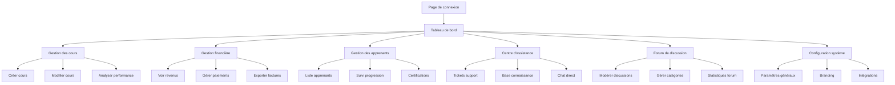

## 1. Vue d'ensemble du produit
Interface administrative unifiée pour les formateurs qui gèrent simultanément les aspects pédagogiques, financiers et administratifs de la plateforme LMS. Cette solution centralise toutes les fonctionnalités nécessaires à la gestion complète d'une plateforme d'apprentissage en ligne.

Cette interface répond aux besoins des formateurs-entrepreneurs qui doivent gérer leurs cours, suivre leurs revenus, assister les apprenants et administrer leur activité depuis un seul tableau de bord.

## 2. Fonctionnalités principales

### 2.1 Rôles utilisateurs
| Rôle | Méthode d'inscription | Permissions principales |
|------|----------------------|------------------------|
| Formateur-Admin | Inscription avec vérification d'identité | Accès complet à tous les modules |
| Assistant Admin | Invitation par Formateur-Admin | Gestion limitée selon les permissions accordées |

### 2.2 Modules fonctionnels
L'interface formateur-admin comprend les pages essentielles suivantes :

1. **Tableau de bord principal** : vue d'ensemble métriques, revenus, activité récente, alertes
2. **Gestion des cours** : création, modification, organisation du contenu pédagogique
3. **Gestion financière** : revenus, paiements, facturation, analytics financiers
4. **Gestion des apprenants** : suivi des inscriptions, progrès, certifications
5. **Centre d'assistance** : tickets support, FAQ, chat en direct
6. **Forum de discussion** : modération des échanges, gestion des communautés
7. **Configuration système** : paramètres généraux, branding, intégrations

### 2.3 Détail des pages
| Page | Module | Description fonctionnelle |
|------|--------|--------------------------|
| Tableau de bord | Vue d'ensemble | Afficher les KPIs principaux (revenus mensuels, nombre d'apprenants, taux de complétion, nouveaux messages) |
| Tableau de bord | Graphiques analytics | Visualiser l'évolution des revenus, croissance des inscriptions, performance des cours |
| Tableau de bord | Alertes urgentes | Notifier les tickets non lus, paiements en attente, problèmes techniques |
| Gestion des cours | Création de cours | Créer des cours avec support vidéo, PDF, quiz, exercices pratiques |
| Gestion des cours | Structure des leçons | Organiser le contenu en modules, chapitres, leçons avec progression logique |
| Gestion des cours | Publication | Planifier la publication, définir les prix, accès gratuit/payant |
| Gestion financière | Tableau des revenus | Consulter les revenus par période, par cours, par apprenant |
| Gestion financière | Gestion des paiements | Voir l'historique des transactions, remboursements, abonnements |
| Gestion financière | Facturation | Générer et télécharger les factures, exporter les données comptables |
| Gestion des apprenants | Liste des inscrits | Voir tous les apprenants avec filtres (actifs, inactifs, par cours) |
| Gestion des apprenants | Suivi de progression | Analyser l'avancement individuel, temps passé, scores aux évaluations |
| Gestion des apprenants | Certifications | Attribuer des certifications, gérer les diplômes numériques |
| Centre d'assistance | Tickets support | Consulter et répondre aux demandes d'aide, assigner des priorités |
| Centre d'assistance | Base de connaissance | Créer et organiser la FAQ, tutoriels, guides d'utilisation |
| Forum de discussion | Modération | Approuver/rejeter les messages, gérer les signalements |
| Forum de discussion | Catégories | Créer et organiser les sections de discussion par thème |
| Configuration système | Paramètres généraux | Définir le nom de la plateforme, logo, couleurs, langues |
| Configuration système | Intégrations | Connecter des services tiers (Stripe, Mailchimp, Google Analytics) |

## 3. Processus principaux

### Flux Formateur-Admin
1. **Connexion** → Tableau de bord avec vue d'ensemble personnalisée
2. **Gestion des cours** → Création/modification → Publication → Suivi des inscriptions
3. **Gestion financière** → Consultation des revenus → Analyse des performances → Export comptable
4. **Support aux apprenants** → Consultation des tickets → Réponse rapide → Résolution des problèmes
5. **Modération communautaire** → Surveillance des discussions → Intervention si nécessaire

## 4. Interface utilisateur

### 4.1 Style de design
- **Couleurs principales** : Bleu professionnel (#2563EB) avec accents orange (#F59E0B)
- **Couleurs secondaires** : Gris neutres (#6B7280, #9CA3AF) pour l'arrière-plan
- **Style des boutons** : Coins arrondis (8px), ombres subtiles, effet hover
- **Typographie** : Inter pour les titres, Roboto pour le corps du texte
- **Tailles de police** : Titres 24-32px, corps 14-16px, labels 12px
- **Style de layout** : Sidebar navigation fixe (240px) + contenu principal responsive
- **Icônes** : Style line icons (Heroicons) pour cohérence moderne

### 4.2 Vue d'ensemble des pages
| Page | Module | Éléments d'interface |
|------|--------|---------------------|
| Tableau de bord | KPIs | Cartes colorées avec icônes, chiffres clés en gros caractères, variations en pourcentage |
| Tableau de bord | Graphiques | Graphiques en courbes et barres interactifs, légendes claires, tooltips au survol |
| Gestion des cours | Grille de cours | Cartes de cours avec miniature, titre, prix, statut publication, boutons d'action |
| Gestion des cours | Éditeur de contenu | Éditeur riche WYSIWYG, upload drag-and-drop vidéos, aperçu en temps réel |
| Gestion financière | Tableau de revenus | Tableau avec tri/filtrage, total en haut, export CSV/Excel |
| Gestion financière | Graphiques financiers | Camembert répartition revenus, histogramme évolution mensuelle |
| Gestion des apprenants | Liste filtrable | Barre de recherche, filtres multiples, pagination, actions par lot |
| Centre d'assistance | Inbox tickets | Liste conversations avec statut, priorité, assignation, temps de réponse |
| Forum de discussion | Vue modération | Tableau messages avec signalements, boutons modération rapide |
| Configuration système | Formulaires | Champs organisés par sections, validation en temps réel, sauvegarde auto |

### 4.3 Responsive design
- **Desktop-first** : Optimisé pour écrans 1440px et plus
- **Tablette** : Sidebar rétractable, grille adaptable (768px-1024px)
- **Mobile** : Navigation en bas d'écran, menus burger, prioritisation du contenu (< 768px)
- **Interactions tactiles** : Boutons adaptés (48px minimum), swipe